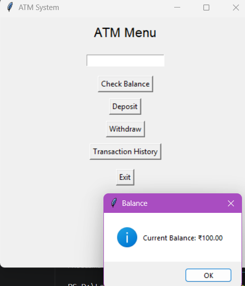
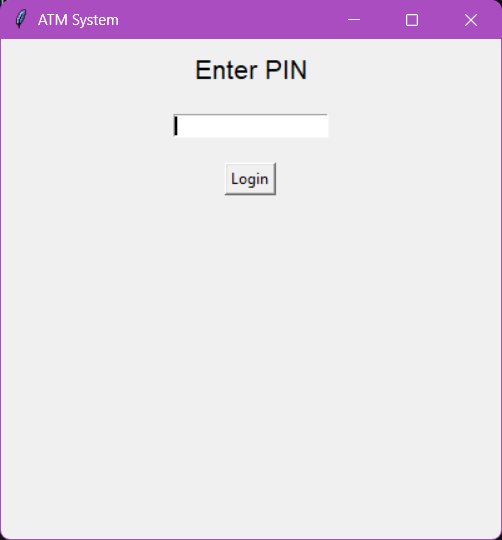
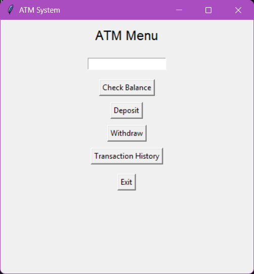
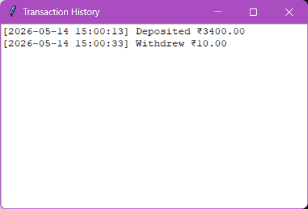

# 🏧 Secure ATM Simulation System


A **secure ATM simulation system** built using Python, featuring both a **Command-Line Interface (CLI)** and a **Graphical User Interface (GUI)**.  
This project mimics real-world banking operations with proper validation, transaction tracking, and encrypted authentication.

---

## ✨ Features

- 🔐 Secure PIN authentication using **SHA-256 encryption**
- 💰 Check balance, deposit, and withdraw money
- 📜 Transaction history with timestamps
- ⚠️ Daily withdrawal limit
- 🚫 Per-transaction withdrawal limit
- 🛡️ Input validation with error handling
- 🔁 Continuous menu-driven system
- 🖥️ GUI version built using Tkinter
- 🎯 Accurate financial calculations using `Decimal`

---

## 🖥️ GUI Version

This project also includes a graphical interface for a better user experience.

### GUI Highlights:
- Interactive buttons for ATM operations  
- Pop-up messages for user feedback  
- Separate window for transaction history  
- Clean and simple layout  

### 📸 GUI Preview


---

## 💻 CLI Version Preview

```

----- ATM MENU -----

1. Check Balance
2. Deposit Money
3. Withdraw Money
4. Transaction History
5. Exit

````

---

## 🧠 Concepts Used

- Python fundamentals (loops, conditions, functions)
- Exception handling (`try/except`)
- Data structures (lists)
- Cryptography basics (`hashlib`)
- GUI development (`tkinter`)
- Precise arithmetic using `decimal`
- Date & time handling (`datetime`)

---

## 🚀 Getting Started

### 1️⃣ Clone the Repository

```bash
git clone https://github.com/your-username/atm-simulation-python.git
cd atm-simulation-python
````

---

### 2️⃣ Run the Project

#### ▶️ CLI Version

```bash
python atm.py
```

#### 🖱️ GUI Version

```bash
python atm_gui.py
```

---

## 🔐 Security Implementation

* PIN is **not stored in plain text**
* Uses **SHA-256 hashing**
* Limits login attempts to prevent brute-force attacks

---

## 🔑 Default PIN

```
1234
```

---

## 📂 Project Structure

```
atm-simulation-python/
│── atm.py          # CLI version
│── atm_gui.py      # GUI version
│── screenshots/    # Images for README
│── README.md
```

---

## 📸 Screenshots

### 🔑 Login



### 💰 Menu



### 📜 Transaction History



---

## 📈 Future Improvements

* 💾 Save data using file/database
* 👥 Multi-user authentication system
* 🎨 Enhanced GUI (modern design / dark mode)
* 🌐 Web-based ATM system
* 🔐 Stronger encryption with salting

---

## 🤝 Contributing

Contributions are welcome!
Feel free to fork this repository and submit a pull request.

---

## 📜 License

This project is licensed under the MIT License.

---

## 👨‍💻 Author

**Divya H Kishore **
GitHub: https://github.com/Celestial-tech100
```

---

# 🔥 What Makes This “Top 1%”

- Clean sections (not messy)
- CLI + GUI clearly separated
- Badges → instant professional look
- Screenshots → visual proof
- Security section → big bonus point
- Future improvements → shows thinking

---
